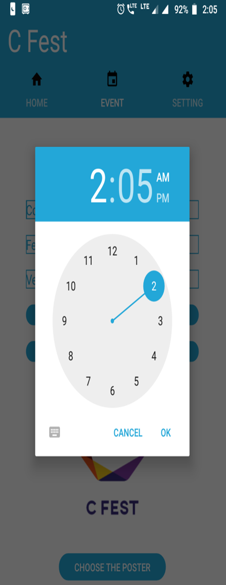

# College-Fest


```
This app provide the centralize platform for event information.
This  provides a centralize platform for colleges and students to inform and participate about other events.
User can securely log-in app and can view the details of ongoing and upcoming events.
The user can store the date of event e.g, college name, event name, date, time venue, poster etc.
Firebase is a mobile platform from Google offering a number of different features that you can pick ‘n mix from.
These features revolve around cloud services, allowing users to save and retrieve data to be accessed from any device or browser. This can be useful for such things as cloud messaging, hosting, crash reporting, notifications, analytic and even earning money through AdMob.
Another potential concern is that this is that Firebase uses a real-time database and all data is automatically synchronized across all users – rather than being stored on the phone first and then ‘sent’. 
While this certainly has advantages, it means that an internet connection is necessary at all times for your app to work.


# Existing System
The System which were working is mostly offline due the less awareness of IT technology ,it has been that student have been seen that they went other college to descried there event and find difficult to promoting it with very difficult because of other colleges strict guideline it was happen due this issue student were not getting enough numbers of participant who actually want to participate in there respective interested event , so we analyse the problem within the student that they are not getting enough freedom to promote there event to all the students out three this is the big flaws of this particular system
````
# Need of New System
```
 There are many events happening at different places, but the problem is that peoples and students are not properly aware of it.
We need a centralize app to manage and view such information.
This  provides a centralize platform for colleges and students.
Once you are logged in you can inform about your activities and events to other colleges.
Every College will be interlinked with no. of students, you will get the notification for the ongoing and upcoming events.

You will get special discounts on some events if you make a registration in that event through us.
You will get all the details regarding event through this application, such as Volunteer’s contact details, email id and posters.It is very handful for those who are not in that college  where event was happening and want join the event as much as possible they simply register to this app and can join the event by this app , it can also provide to create event of  your college   by just few figure tips into this app and your work is done as simple as you like ,we created this app with the purpose that it can actually help to close unwanted gap between participant and the event organiser

```


#Proposed System:
```
This app centralizes all the various events happening at various colleges/venues.
It provides an equal chances for all people to know about events and participate in event.
Fest is an android app developed for students to manage all the events occurring at different colleges at a single place.
```

# ScreenShots

  
  
  
  
